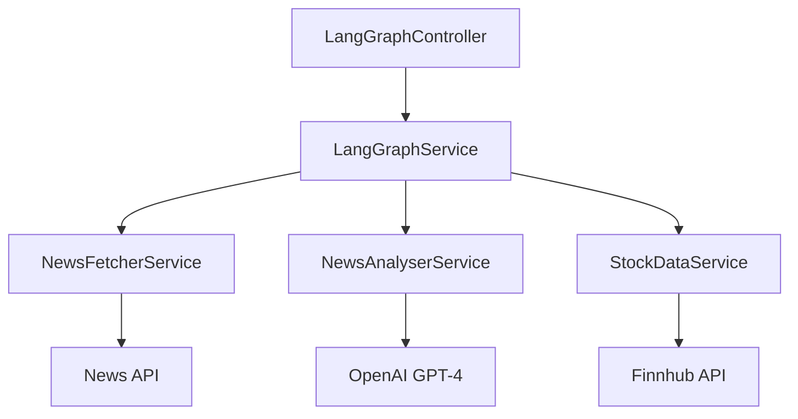

# LangGraph Module Documentation

## Table of Contents

- [Overview](#overview)
- [Architecture](#architecture)
  - [Core Components](#core-components)
- [Workflow](#workflow)
- [API Endpoints](#api-endpoints)
- [Error Handling](#error-handling)
- [Configuration](#configuration)
- [Dependencies](#dependencies)
- [Testing & Diagnostics](#testing--diagnostics)
  - [Component Testing](#component-testing)
  - [Diagnostic Steps](#diagnostic-steps)
  - [Logging Levels](#logging-levels)
  - [Error Investigation](#error-investigation)
  - [Performance Monitoring](#performance-monitoring)
  - [Common Error Patterns](#common-error-patterns)
  - [Debugging Tools](#debugging-tools)
  - [Health Checks](#health-checks)
  - [Development Tips](#development-tips)
  - [Troubleshooting Checklist](#troubleshooting-checklist)
  - [Getting Help](#getting-help)

## Overview

The LangGraph module is a sophisticated multi-agent system for financial news analysis and stock data processing. It implements a sequential workflow that combines news fetching, AI-powered analysis, and stock market data integration to provide comprehensive financial insights.

## Architecture

The module follows a modular architecture with distinct services orchestrated by a main service:



### Core Components

1. **LangGraphService**
   - Orchestrates the workflow using LangChain's `RunnableSequence`
   - Manages state transitions between different analysis steps
   - Handles error propagation and recovery

2. **NewsFetcherService**
   - Integrates with NewsAPI
   - Retrieves relevant financial news articles
   - Filters and formats news data

3. **NewsAnalyserService**
   - Leverages OpenAI's GPT-4 for news analysis
   - Extracts key themes and sentiment
   - Identifies relevant stock tickers

4. **StockDataService**
   - Integrates with Finnhub API
   - Retrieves real-time stock market data
   - Provides price, change, and other market metrics

## Workflow

1. **Input**:
   - Query string (required)
   - Stock ticker (optional)

2. **Process Flow**:

   ```
   Query → News Fetch → AI Analysis → Stock Data → Final Response
   ```

3. **State Management**:
   - Uses `NewsAnalysisState` interface to maintain context
   - Propagates data and errors through the workflow
   - Preserves intermediate results

## API Endpoints

### POST /news-analysis/analyze

Analyzes financial news and stock data.

**Request Body (AnalyzeNewsDto)**:

```typescript
{
  query: string;   // Search query for news
  ticker?: string; // Optional stock ticker
}
```

**Response (NewsAnalysisResponseDto)**:

```typescript
{
  query: string;           // Original search query
  ticker?: string;        // Stock ticker
  articles?: NewsArticle[]; // Retrieved articles
  analysis?: string;      // AI-generated analysis
  stockInfo?: StockInfo;  // Market data
  error?: string;         // Error message if any
}
```

## Error Handling

- Each service implements robust error handling
- Errors are propagated through the state object
- Failed steps don't interrupt the entire workflow
- Detailed logging for debugging and monitoring

## Configuration

Required environment variables:

- `NEWS_API_KEY`: NewsAPI authentication
- `OPENAI_API_KEY`: OpenAI API access
- `FINNHUB_API_KEY`: Finnhub API authentication

## Dependencies

- @nestjs/common
- @langchain/core
- @langchain/openai
- @nestjs/swagger

## Testing & Diagnostics

### Component Testing

1. **LangGraphService Tests**
   ```typescript
   // Example test structure
   describe('LangGraphService', () => {
     it('should process news analysis workflow', async () => {
       const result = await service.analyze({ query: 'AAPL earnings' });
       expect(result.analysis).toBeDefined();
     });
   });
   ```

### Diagnostic Steps

#### 1. News Fetcher Validation
- Check API response:
  ```typescript
  // In NewsFetcherService
  const response = await this.newsApi.fetchNews(query);
  this.logger.debug('News API Response:', response);
  ```
- Common issues:
  - Invalid/expired NEWS_API_KEY
  - Rate limiting
  - Network connectivity
  - Malformed query parameters

#### 2. News Analysis Validation
- Debug OpenAI responses:
  ```typescript
  // In NewsAnalyserService
  this.logger.debug('OpenAI Input:', analysisPrompt);
  this.logger.debug('OpenAI Response:', analysisResult);
  ```
- Common issues:
  - Invalid OPENAI_API_KEY
  - Prompt formatting errors
  - Token limit exceeded
  - Rate limiting

#### 3. Stock Data Validation
- Check Finnhub data:
  ```typescript
  // In StockDataService
  this.logger.debug('Finnhub Response:', stockData);
  ```
- Common issues:
  - Invalid FINNHUB_API_KEY
  - Invalid ticker symbols
  - Market hours limitations
  - Rate limiting

### Logging Levels

Enable detailed logging by setting the appropriate log level:

```typescript
// In module configuration
{
  logger: {
    level: process.env.NODE_ENV === 'development' ? 'debug' : 'info'
  }
}
```

### Error Investigation

1. **State Transitions**
   - Each step in the workflow updates the state
   - Check state progression:
     ```typescript
     {
       initialState: { query },
       afterNewsFetch: { query, articles },
       afterAnalysis: { query, articles, analysis },
       finalState: { query, articles, analysis, stockInfo }
     }
     ```

2. **API Integration Issues**
   - Use the built-in request interceptor:
     ```typescript
     // In your service
     this.httpService.axiosRef.interceptors.request.use((config) => {
       this.logger.debug('Outgoing Request:', {
         url: config.url,
         method: config.method,
         headers: config.headers
       });
       return config;
     });
     ```

### Performance Monitoring

1. **Timing Metrics**
   ```typescript
   // Add timing decorators
   @TimeMetric()
   async analyzeNews(query: string): Promise<NewsAnalysisState> {
     // Implementation
   }
   ```

2. **Memory Usage**
   - Monitor heap usage for large requests
   - Watch for memory leaks in long-running processes

### Common Error Patterns

1. **News Fetching Errors**
   - No results found
   - API quota exceeded
   - Invalid query format

2. **Analysis Errors**
   - Token limit exceeded
   - Invalid response format
   - Timeout issues

3. **Stock Data Errors**
   - Invalid ticker symbols
   - Market closed
   - Rate limiting

### Debugging Tools

1. **REST Client Testing**
   Create a `requests.http` file:
   ```http
   ### Test News Analysis
   POST http://localhost:3001/api/news-analysis/analyze
   Content-Type: application/json

   {
     "query": "AAPL earnings report",
     "ticker": "AAPL"
   }
   ```

2. **Environment Validation**
   ```bash
   # Validate environment variables
   pnpm nx run server:check-env
   ```

### Health Checks

1. **API Health Endpoint**
   ```typescript
   @Get('health')
   async checkHealth() {
     return {
       newsApi: await this.newsFetcher.checkHealth(),
       openai: await this.newsAnalyser.checkHealth(),
       finnhub: await this.stockData.checkHealth()
     };
   }
   ```

2. **Service Status Monitoring**
   - Monitor individual service health
   - Track API rate limits
   - Watch for timeout patterns

### Development Tips

1. **Local Testing**
   - Use mock data for development
   - Create test fixtures for common scenarios
   - Implement retry logic for flaky APIs

2. **Error Recovery**
   - Implement graceful fallbacks
   - Cache successful responses
   - Use circuit breakers for external APIs

3. **Monitoring Setup**
   - Enable detailed logging in development
   - Track API usage and quotas
   - Monitor performance metrics

### Troubleshooting Checklist

1. **Initial Setup**
   - [ ] All required environment variables set
   - [ ] API keys validated and active
   - [ ] Network connectivity confirmed

2. **Runtime Issues**
   - [ ] Check service logs for errors
   - [ ] Verify API response formats
   - [ ] Monitor rate limiting status
   - [ ] Validate input data format

3. **Performance Issues**
   - [ ] Monitor response times
   - [ ] Check memory usage
   - [ ] Verify concurrent request handling
   - [ ] Review API quotas

### Getting Help

If you encounter issues:

1. Check the logs with increased verbosity
2. Review the state transitions
3. Validate external API responses
4. Check rate limits and quotas
5. Review recent code changes
6. Consult API documentation for updates

For additional support:
- Review issue tracker for similar problems
- Check API status pages
- Contact the development team

## Dependencies

- @nestjs/common
- @langchain/core
- @langchain/openai
- @nestjs/swagger
