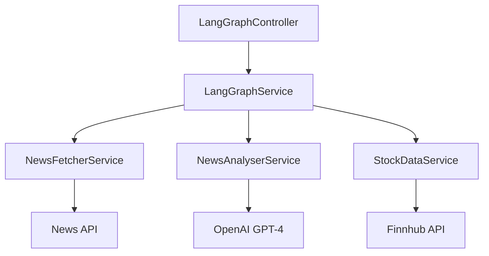

# LangGraph Module Documentation

## Overview

The LangGraph module is a sophisticated multi-agent system for financial news analysis and stock data processing. It implements a sequential workflow that combines news fetching, AI-powered analysis, and stock market data integration to provide comprehensive financial insights.

## Architecture

The module follows a modular architecture with distinct services orchestrated by a main service:



### Core Components

1. **LangGraphService**
   - Orchestrates the workflow using LangChain's `RunnableSequence`
   - Manages state transitions between different analysis steps
   - Handles error propagation and recovery

2. **NewsFetcherService**
   - Integrates with NewsAPI
   - Retrieves relevant financial news articles
   - Filters and formats news data

3. **NewsAnalyserService**
   - Leverages OpenAI's GPT-4 for news analysis
   - Extracts key themes and sentiment
   - Identifies relevant stock tickers

4. **StockDataService**
   - Integrates with Finnhub API
   - Retrieves real-time stock market data
   - Provides price, change, and other market metrics

## Workflow

1. **Input**:
   - Query string (required)
   - Stock ticker (optional)

2. **Process Flow**:

   ```
   Query → News Fetch → AI Analysis → Stock Data → Final Response
   ```

3. **State Management**:
   - Uses `NewsAnalysisState` interface to maintain context
   - Propagates data and errors through the workflow
   - Preserves intermediate results

## API Endpoints

### POST /news-analysis/analyze

Analyzes financial news and stock data.

**Request Body (AnalyzeNewsDto)**:

```typescript
{
  query: string;   // Search query for news
  ticker?: string; // Optional stock ticker
}
```

**Response (NewsAnalysisResponseDto)**:

```typescript
{
  query: string;           // Original search query
  ticker?: string;        // Stock ticker
  articles?: NewsArticle[]; // Retrieved articles
  analysis?: string;      // AI-generated analysis
  stockInfo?: StockInfo;  // Market data
  error?: string;         // Error message if any
}
```

## Error Handling

- Each service implements robust error handling
- Errors are propagated through the state object
- Failed steps don't interrupt the entire workflow
- Detailed logging for debugging and monitoring

## Configuration

Required environment variables:

- `NEWS_API_KEY`: NewsAPI authentication
- `OPENAI_API_KEY`: OpenAI API access
- `FINNHUB_API_KEY`: Finnhub API authentication

## Dependencies

- @nestjs/common
- @langchain/core
- @langchain/openai
- @nestjs/swagger
