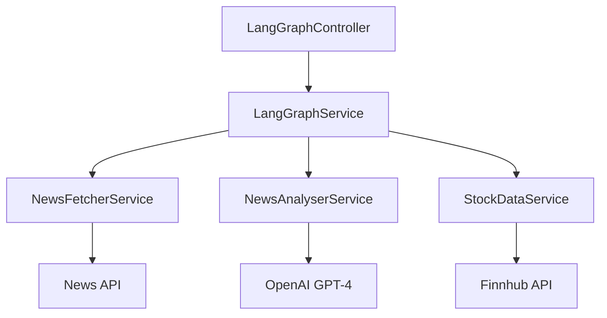

# LangGraph Module Documentation

## Overview

The LangGraph module is a sophisticated multi-agent system for financial news analysis and stock data processing. It implements a sequential workflow that combines news fetching, AI-powered analysis, and stock market data integration to provide comprehensive financial insights.

## Architecture

The module follows a modular architecture with distinct services orchestrated by a main service:



### Core Components

1. **LangGraphService**
   - Orchestrates the workflow using LangChain's `RunnableSequence`
   - Manages state transitions between different analysis steps
   - Handles error propagation and recovery

2. **NewsFetcherService**
   - Integrates with NewsAPI
   - Retrieves relevant financial news articles
   - Filters and formats news data

3. **NewsAnalyserService**
   - Leverages OpenAI's GPT-4 for news analysis
   - Extracts key themes and sentiment
   - Identifies relevant stock tickers

4. **StockDataService**
   - Integrates with Finnhub API
   - Retrieves real-time stock market data
   - Provides price, change, and other market metrics

## Workflow

1. **Input**:
   - Query string (required)
   - Stock ticker (optional)

2. **Process Flow**:

   ```
   Query → News Fetch → AI Analysis → Stock Data → Final Response
   ```

3. **State Management**:
   - Uses `NewsAnalysisState` interface to maintain context
   - Propagates data and errors through the workflow
   - Preserves intermediate results

## API Endpoints

### POST /news-analysis/analyze

Analyzes financial news and stock data.

**Request Body (AnalyzeNewsDto)**:

```typescript
{
  query: string;   // Search query for news
  ticker?: string; // Optional stock ticker
}
```

**Response (NewsAnalysisResponseDto)**:

```typescript
{
  query: string;           // Original search query
  ticker?: string;        // Stock ticker
  articles?: NewsArticle[]; // Retrieved articles
  analysis?: string;      // AI-generated analysis
  stockInfo?: StockInfo;  // Market data
  error?: string;         // Error message if any
}
```

## Error Handling

- Each service implements robust error handling
- Errors are propagated through the state object
- Failed steps don't interrupt the entire workflow
- Detailed logging for debugging and monitoring

## Configuration

Required environment variables:

- `NEWS_API_KEY`: NewsAPI authentication
- `OPENAI_API_KEY`: OpenAI API access
- `FINNHUB_API_KEY`: Finnhub API authentication

## Dependencies

- @nestjs/common
- @langchain/core
- @langchain/openai
- @nestjs/swagger

## Testing & Diagnostics

### Manual Testing Options

#### Using Swagger UI

1. Start the server: `pnpm nx serve server`
2. Navigate to: `http://localhost:3001/api/docs`
3. Locate the "News Analysis" section
4. Try the `/news-analysis/analyze` endpoint with sample payloads:

```json
{
  "query": "Tesla Q4 earnings",
  "ticker": "TSLA"
}
```

```json
{
  "query": "Apple new product launch"
  // Let ticker auto-detect
}
```

#### Using REST Client

Add these requests to your `api.http` file:

```http
### Analyze News with Ticker
POST {{baseUrl}}/news-analysis/analyze
Content-Type: application/json

{
    "query": "Tesla Q4 earnings",
    "ticker": "TSLA"
}

### Analyze News without Ticker
POST {{baseUrl}}/news-analysis/analyze
Content-Type: application/json

{
    "query": "Apple new product launch"
}
```

### Accessing Logs

#### Development Logs

When running the server locally (`pnpm nx serve server`), logs are output to:

1. Console output in your terminal
2. Log files in `apps/server/logs/`:
   - `error.log`: Error-level messages
   - `combined.log`: All log levels
   - `debug.log`: Debug-level details

#### Production Logs

In production, logs are available through:

1. CloudWatch Logs under `/erisfy/api/langgraph/*`
2. Datadog APM under service `erisfy-api` with tag `module:langgraph`

#### Log Format

Each log entry follows this structure:

```
[Timestamp] [Level] [Service] Message
Example: [2024-02-14 10:15:23] [INFO] [NewsFetcherService] Fetching news for query: Tesla
```

### Diagnostic Checkpoints

1. **News Fetching Phase**
   - **Where to look**:
     - Development: `apps/server/logs/combined.log`
     - Production: CloudWatch `/erisfy/api/langgraph/newsfetcher`
   - **What to check**:

     ```log
     [NewsFetcherService] Fetching news for query: {query}
     [NewsFetcherService] Retrieved {count} articles
     [NewsFetcherService] Request to NewsAPI completed in {time}ms
     ```

2. **Analysis Phase**
   - **Where to look**:
     - Development: `apps/server/logs/combined.log`
     - Production: CloudWatch `/erisfy/api/langgraph/newsanalyser`
   - **What to check**:

     ```log
     [NewsAnalyserService] Analyzing {count} news articles
     [NewsAnalyserService] OpenAI request started
     [NewsAnalyserService] Analysis completed in {time}ms
     ```

3. **Stock Data Phase**
   - **Where to look**:
     - Development: `apps/server/logs/combined.log`
     - Production: CloudWatch `/erisfy/api/langgraph/stockdata`
   - **What to check**:

     ```log
     [StockDataService] Fetching data for ticker: {ticker}
     [StockDataService] Finnhub API request completed in {time}ms
     ```

#### Error Logs

For errors, always check:

1. Development: `apps/server/logs/error.log`
2. Production:
   - CloudWatch `/erisfy/api/langgraph/error`
   - Datadog Events with tag `severity:error`

#### Viewing Logs

1. **Development Environment**

   ```bash
   # Tail the combined log
   tail -f apps/server/logs/combined.log

   # Search for specific service logs
   grep "NewsFetcherService" apps/server/logs/combined.log

   # View recent errors
   tail -f apps/server/logs/error.log
   ```

2. **Production Environment**

   ```bash
   # Using AWS CLI
   aws logs get-log-events \
     --log-group-name "/erisfy/api/langgraph" \
     --log-stream-name "newsanalyser" \
     --limit 100

   # Using Datadog CLI
   dog stream-logs "service:erisfy-api module:langgraph"
   ```

### Monitoring Response Quality

1. **News Articles**
   - Should receive 3-5 relevant articles
   - Articles should be recent (within last 24-48 hours)
   - Articles should match query context

2. **AI Analysis**
   - Should contain structured insights
   - Should identify key market themes
   - Should extract mentioned companies/tickers
   - Should provide clear market impact analysis

3. **Stock Data**
   - Should provide real-time market data
   - Should include price movements
   - Should match identified ticker

### Common Error Patterns

Monitor these specific error messages in the response:

```typescript
{
  error: "Failed to fetch news: {specific error}"
  // News API issues
}

{
  error: "Failed to analyze news: {specific error}"
  // OpenAI API issues
}

{
  error: "Failed to fetch stock data: {specific error}"
  // Finnhub API issues
}
```

### Performance Benchmarks

Typical response times:

- News Fetch: < 1s
- Analysis: 2-5s
- Stock Data: < 500ms
- Total Request: 3-7s

### Development Tips

1. Use environment-specific API keys for testing
2. Monitor rate limits across all services:
   - NewsAPI: 100 requests/day (free tier)
   - OpenAI: Varies by tier
   - Finnhub: 60 calls/minute

3. Test error scenarios:
   - Invalid API keys
   - Malformed queries
   - Rate limit exceeded
   - Network timeouts

4. For debugging, check logs in order:
   1. NewsFetcherService
   2. NewsAnalyserService
   3. StockDataService
   4. LangGraphService workflow execution
