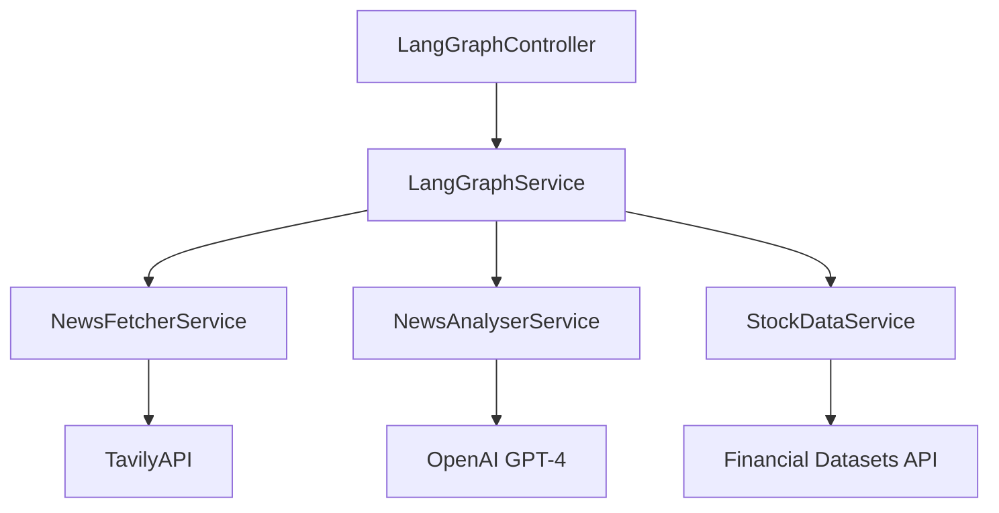

# LangGraph Module Documentation

[← Back to Server Documentation](../../../README.md)

## Overview

The LangGraph module is a sophisticated multi-agent system that combines news fetching, AI-powered analysis, and stock market data integration to provide comprehensive financial insights. It implements a sequential workflow using LangChain's RunnableSequence.

## Architecture

The module follows a modular architecture with distinct services, orchestrated by the main LangGraphService:



### Core Components

1. **LangGraphService**
   - Orchestrates the workflow using LangChain's `RunnableSequence`
   - Manages state transitions between steps
   - Handles error propagation through state object
   - Provides graceful degradation when services fail

2. **NewsFetcherService**
   - Integrates with Tavily API for intelligent news search
   - Implements caching with 5-minute TTL
   - Handles request deduplication
   - Enriches and filters articles for relevancy
   - Maps API responses to internal article format

3. **NewsAnalyserService**
   - Uses OpenAI's GPT-4 for analysis
   - Zero temperature for consistent outputs
   - Implements system and human message chain
   - Extracts potential stock tickers
   - Provides structured financial insights

4. **StockDataService**
   - Integrates with Financial Datasets API
   - Retrieves financial metrics
   - Handles ticker validation
   - Provides normalized market metrics

## Workflow

1. **Input**
   - Query string (optional, analyzes top financial news if not provided)
   - Stock ticker (optional)

2. **Process Flow**

   ```plaintext
   Query → News Fetch → AI Analysis → Stock Data → Final Response
   ```

3. **State Management**

   ```typescript
   interface NewsAnalysisState {
     query?: string;           // Search query or topic
     ticker?: string;         // Stock ticker symbol
     articles: NewsArticle[]; // Retrieved articles
     analysis: string;       // Generated analysis
     stockInfo?: StockInfo;  // Market data
     error?: string;         // Error messages
     isDefaultQuery?: boolean; // Using default top news query
   }
   ```

## API Endpoints

### POST /news-analysis/analyze

Analyzes financial news and stock data.

**Request Body**:

```typescript
{
  query?: string;   // Search query for news (optional)
  ticker?: string;  // Stock ticker (optional)
}
```

**Response**:

```typescript
{
  query: string;            // Original or default query
  ticker?: string;         // Stock ticker
  articles?: NewsArticle[]; // Retrieved articles
  analysis?: string;       // AI-generated analysis
  stockInfo?: StockInfo;   // Market data if available
  error?: string;         // Error message if any
}
```

## Error Handling

- Each service implements robust error handling
- Errors are propagated through state object
- Failed steps do not interrupt workflow
- Detailed logging for debugging

## Configuration

Required environment variables:

```env
OPENAI_API_KEY=your_openai_api_key
TAVILY_API_KEY=your_tavily_api_key
FINANCIAL_DATASETS_API_KEY=your_financial_datasets_api_key
FINANCIAL_DATASETS_API_BASE_URL=your_financial_datasets_api_base_url
```

## Testing and Diagnostics

### Component Testing

```typescript
describe('LangGraphService', () => {
  it('should process news analysis workflow', async () => {
    const result = await service.analyse({ query: 'AAPL earnings' });
    expect(result.analysis).toBeDefined();
  });
});
```

### Manual Testing Options

#### Using Swagger UI

1. Navigate to <http://localhost:3001/api/docs>
2. Locate the "News Analysis" section
3. Try the `/news-analysis/analyze` endpoint with sample payloads:

```json
{
  "query": "Tesla Q4 earnings",
  "ticker": "TSLA"
}
```

#### Using a REST Client

Add requests to api.http:

```http
### Analyze News with Ticker
POST http://localhost:3001/news-analysis/analyze
Content-Type: application/json

{
    "query": "Tesla Q4 earnings",
    "ticker": "TSLA"
}
```

### Logging and Diagnostics

#### Development Logs

- Console output when running `pnpm nx serve server`
- Log files in `apps/server/logs/`:
  - `error.log`: Error-level messages
  - `combined.log`: All log levels
  - `debug.log`: Debug-level details

#### Log Format

```plaintext
[Timestamp] [Level] [Service] Message
Example: [2024-02-14 10:15:23] [INFO] [NewsFetcherService] Fetching news for query: Tesla
```

#### Diagnostic Checkpoints

1. **News Fetching Phase**

   ```log
   [NewsFetcherService] Fetching news for query: {query}
   [NewsFetcherService] Retrieved {count} articles
   [NewsFetcherService] Tavily search completed in {time}ms
   ```

2. **Analysis Phase**

   ```log
   [NewsAnalyserService] Analysing {count} news articles
   [NewsAnalyserService] OpenAI request started
   [NewsAnalyserService] Analysis completed in {time}ms
   ```

3. **Stock Data Phase**

   ```log
   [StockDataService] Fetching data for ticker: {ticker}
   [StockDataService] Financial Datasets API request completed in {time}ms
   ```

## Common Error Patterns

1. **News Fetching Errors**
   - Tavily API request failures
   - Invalid search parameters
   - No results found
   - API quota exceeded
   - Network connectivity issues

2. **Analysis Errors**
   - OpenAI API errors
   - Token limit exceeded
   - Invalid response format
   - Message chain formatting errors

3. **Stock Data Errors**
   - Financial Datasets API failures
   - Missing snapshot data
   - Invalid ticker symbols
   - Rate limiting issues
   - Network timeouts

## Performance Monitoring

1. **Timing Metrics**
   - Each phase logs completion time
   - Watch for slow operations

2. **Memory Usage**
   - Monitor heap for large requests
   - Watch for memory leaks

## Getting Help

If you encounter issues:

1. Check logs with increased verbosity
2. Review state transitions
3. Validate API responses
4. Check rate limits
5. Review code changes
6. Consult API documentation

For support:

- Review issue tracker
- Check API status pages
- Contact development team
