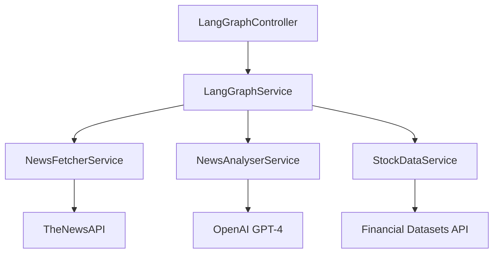

# LangGraph Module Documentation

[← Back to Server Documentation](../../../README.md)

## Table of Contents

- [Overview](#overview)  
- [Architecture](#architecture)  
  - [Core Components](#core-components)  
- [Workflow](#workflow)  
- [API Endpoints](#api-endpoints)  
- [Error Handling](#error-handling)  
- [Configuration](#configuration)  
- [Dependencies](#dependencies)  
- [Testing and Diagnostics](#testing-and-diagnostics)  
  - [Component Testing](#component-testing)  
  - [Manual Testing Options](#manual-testing-options)  
    - [Using Swagger UI](#using-swagger-ui)  
    - [Using a REST Client](#using-a-rest-client)  
  - [Logging and Diagnostics](#logging-and-diagnostics)  
    - [Logging Levels](#logging-levels)  
    - [Accessing Logs](#accessing-logs)  
    - [Log Format](#log-format)  
    - [Diagnostic Checkpoints](#diagnostic-checkpoints)  
    - [Error Investigation](#error-investigation)  
  - [Performance Monitoring](#performance-monitoring)  
  - [Common Error Patterns](#common-error-patterns)  
  - [Debugging Tools](#debugging-tools)  
  - [Health Checks](#health-checks)  
  - [Development Tips](#development-tips)  
  - [Troubleshooting Checklist](#troubleshooting-checklist)  
  - [Getting Help](#getting-help)  

---

## Overview

The LangGraph module is a sophisticated multi-agent system for financial news analysis and stock data processing. It implements a sequential workflow that combines news fetching, AI-powered analysis and stock market data integration to provide comprehensive financial insights.

---

## Architecture

The module follows a modular architecture with distinct services, orchestrated by a main service:



### Core Components

1. **LangGraphService**  
   - Orchestrates the workflow using LangChain's `RunnableSequence`.  
   - Manages state transitions between different analysis steps.  
   - Handles error propagation and recovery through state object.  
   - Implements comprehensive error handling with state updates.

2. **NewsFetcherService**  
   - Integrates with TheNewsAPI.  
   - Retrieves financial news articles based on search query.  
   - Handles URL encoding and API authentication.  
   - Maps API response to internal article format.

3. **NewsAnalyserService**  
   - Leverages OpenAI's GPT-4 for news analysis.  
   - Uses zero temperature for consistent outputs.  
   - Implements system and human message chain.  
   - Provides structured financial insights.

4. **StockDataService**  
   - Integrates with Financial Datasets API.  
   - Retrieves financial metrics and market data.  
   - Handles stock ticker validation.  
   - Provides normalized market metrics.

---

## Workflow

1. **Input**  
   - Query string (required).  
   - Stock ticker (optional).

2. **Process Flow**  

   ```plaintext
   Query → News Fetch → AI Analysis → Stock Data → Final Response
   ```

3. **State Management**  
   - Uses `NewsAnalysisState` interface to maintain context.  
   - Propagates data and errors through the workflow.  
   - Preserves intermediate results.

---

## API Endpoints

### POST /news-analysis/analyze

Analyzes financial news and stock data.

**Request Body (`AnalyzeNewsDto` in code)**:

```typescript
{
  query: string;   // Search query for news
  ticker?: string; // Optional stock ticker
}
```

**Response (`NewsAnalysisResponseDto` in code)**:

```typescript
{
  query: string;            // Original search query
  ticker?: string;          // Stock ticker
  articles?: NewsArticle[]; // Retrieved articles
  analysis?: string;        // AI-generated analysis
  stockInfo?: StockInfo;    // Market data
  error?: string;           // Error message if any
}
```

---

## Error Handling

- Each service implements robust error handling.  
- Errors are propagated through the state object.  
- Failed steps do not interrupt the entire workflow.  
- Detailed logging for debugging and monitoring.

---

## Configuration

Required environment variables:

```env
NEWS_API_TOKEN=your_thenewsapi_token
NEWS_API_BASE_URL=https://api.thenewsapi.com/v1/news
OPENAI_API_KEY=your_openai_api_key
FINANCIAL_DATASETS_API_KEY=your_financial_datasets_api_key
FINANCIAL_DATASETS_API_BASE_URL=your_financial_datasets_api_base_url
```

---

## Dependencies

- `@nestjs/common`  
- `@langchain/core`  
- `@langchain/openai`  
- `@nestjs/swagger`

---

## Testing and Diagnostics

### Component Testing

1. **LangGraphService Tests**  

   ```typescript
   describe('LangGraphService', () => {
     it('should process news analysis workflow', async () => {
       const result = await service.analyse({ query: 'AAPL earnings' });
       expect(result.analysis).toBeDefined();
     });
   });
   ```

---

### Manual Testing Options

#### Using Swagger UI

1. Start the server:  

   ```bash
   pnpm nx serve server
   ```

2. Navigate to:  

   ```plaintext
   http://localhost:3001/api/docs
   ```

3. Locate the "News Analysis" section.  
4. Try the `/news-analysis/analyze` endpoint with sample payloads:

```json
{
  "query": "Tesla Q4 earnings",
  "ticker": "TSLA"
}
```

```json
{
  "query": "Apple new product launch"
}
```

#### Using a REST Client

Add the following requests to a file named `api.http` or `requests.http`:

```http
### Analyze News with Ticker
POST http://localhost:3001/news-analysis/analyze
Content-Type: application/json

{
    "query": "Tesla Q4 earnings",
    "ticker": "TSLA"
}

### Analyze News without Ticker
POST http://localhost:3001/news-analysis/analyze
Content-Type: application/json

{
    "query": "Apple new product launch"
}
```

---

### Logging and Diagnostics

#### Logging Levels

Enable detailed logging by setting the appropriate log level:

```typescript
// In module configuration
{
  logger: {
    level: process.env.NODE_ENV === 'development' ? 'debug' : 'info'
  }
}
```

#### Accessing Logs

### Development Logs

#### Console Output

- Output to console when running `pnpm nx serve server`.  

#### Log Files

- Log files in `apps/server/logs/`:
  - `error.log`: Error-level messages  
  - `combined.log`: All log levels  
  - `debug.log`: Debug-level details  

### Production Logs

#### Cloud Logs

- Available through CloudWatch Logs under `/erisfy/api/langgraph/*`.  

#### APM Metrics

- Datadog APM under service `erisfy-api` with tag `module:langgraph`.

#### Log Format

Each log entry follows this structure:

```plaintext
[Timestamp] [Level] [Service] Message
Example: [2024-02-14 10:15:23] [INFO] [NewsFetcherService] Fetching news for query: Tesla
```

#### Diagnostic Checkpoints

1. **News Fetching Phase**
   - **Where to look**:
     - Development: `apps/server/logs/combined.log`
     - Production: CloudWatch `/erisfy/api/langgraph/newsfetcher`
   - **What to check**:

     ```log
     [NewsFetcherService] Fetching news for query: {query}
     [NewsFetcherService] Retrieved {count} articles
     [NewsFetcherService] Request to TheNewsAPI completed in {time}ms
     ```

2. **Analysis Phase**
   - **Where to look**:
     - Development: `apps/server/logs/combined.log`
     - Production: CloudWatch `/erisfy/api/langgraph/newsanalyser`
   - **What to check**:

     ```log
     [NewsAnalyserService] Analysing {count} news articles
     [NewsAnalyserService] OpenAI request started
     [NewsAnalyserService] Analysis completed in {time}ms
     ```

3. **Stock Data Phase**
   - **Where to look**:
     - Development: `apps/server/logs/combined.log`
     - Production: CloudWatch `/erisfy/api/langgraph/stockdata`
   - **What to check**:

     ```log
     [StockDataService] Fetching data for ticker: {ticker}
     [StockDataService] Financial Datasets API request completed in {time}ms
     ```

#### Error Investigation

1. **State Transitions**
   - Each step updates the state object in the workflow.
   - Check progression:

     ```typescript
     {
       initialState: { query },
       afterNewsFetch: { query, articles },
       afterAnalysis: { query, articles, analysis },
       finalState: { query, articles, analysis, stockInfo }
     }
     ```

2. **API Integration Issues**
   - Use request interceptors to log outgoing requests.
   - Watch for invalid/expired credentials and rate limiting errors.

---

### Performance Monitoring

1. **Timing Metrics**  
   Consider adding timing decorators or manual measurement in services to record how long each phase takes.

2. **Memory Usage**  
   - Monitor heap usage for large requests.  
   - Watch for possible memory leaks in long-running processes.

---

### Common Error Patterns

1. **News Fetching Errors**  
   - TheNewsAPI request failures (HTTP status errors)  
   - No results for query  
   - API quota exceeded  
   - Network connectivity issues

2. **Analysis Errors**  
   - OpenAI API errors  
   - Token limit exceeded  
   - Invalid response format  
   - Temperature setting issues  
   - Message chain formatting errors

3. **Stock Data Errors**  
   - Financial Datasets API request failures  
   - Missing snapshot data  
   - Invalid ticker symbols  
   - Rate limiting issues  
   - Network timeouts

---

### Debugging Tools

1. **REST Client Testing**  
   Create a `requests.http` file:

   ```http
   ### Test News Analysis
   POST http://localhost:3001/api/news-analysis/analyze
   Content-Type: application/json

   {
     "query": "AAPL earnings report",
     "ticker": "AAPL"
   }
   ```

2. **Environment Validation**  

   ```bash
   # Validate environment variables
   pnpm nx run server:check-env
   ```

---

### Health Checks

1. **API Health Endpoint**

   ```typescript
   @Get('health')
   async checkHealth() {
     return {
       thenewsapi: await this.newsFetcher.checkHealth(),
       openai: await this.newsAnalyser.checkHealth(),
       financialdatasets: await this.stockData.checkHealth()
     };
   }
   ```

2. **Service Status Monitoring**
   - Monitor individual service health.  
   - Track API rate limits.  
   - Watch for timeout patterns.

---

### Development Tips

### Local Testing

#### Mock Data Usage

- Use mock data for development.  

#### Test Fixtures

- Create test fixtures for common scenarios.  

#### API Resilience

- Implement retry logic for flaky APIs.

### Error Recovery

#### Fallback Strategies

- Implement graceful fallbacks when external services fail.  

#### Response Caching

- Cache successful responses.  

#### Circuit Breaking

- Use circuit breakers to handle repeated failures.

### Monitoring Setup

#### Log Configuration

- Enable detailed logging in development.  

#### Usage Tracking

- Track API usage and quotas.  

#### Performance

- Monitor performance metrics.

---

### Troubleshooting Checklist

1. **Initial Setup**
   - [ ] All required environment variables are set.  
   - [ ] API keys are validated and active.  
   - [ ] Network connectivity confirmed.

2. **Runtime Issues**
   - [ ] Check service logs for errors.  
   - [ ] Verify external API responses.  
   - [ ] Monitor rate limiting status.  
   - [ ] Validate input data format.

3. **Performance Issues**
   - [ ] Monitor response times.  
   - [ ] Check memory usage.  
   - [ ] Verify concurrent request handling.  
   - [ ] Review API quotas.

---

### Getting Help

If you encounter problems:

1. Check logs with increased verbosity.  
2. Review the state transitions for anomalies.  
3. Validate external API responses.  
4. Check rate limits and quotas.  
5. Review recent code changes.  
6. Consult API documentation for updates.

For further support:

- Review the issue tracker for similar problems.  
- Check the relevant API status pages.  
- Contact the development team.

---
