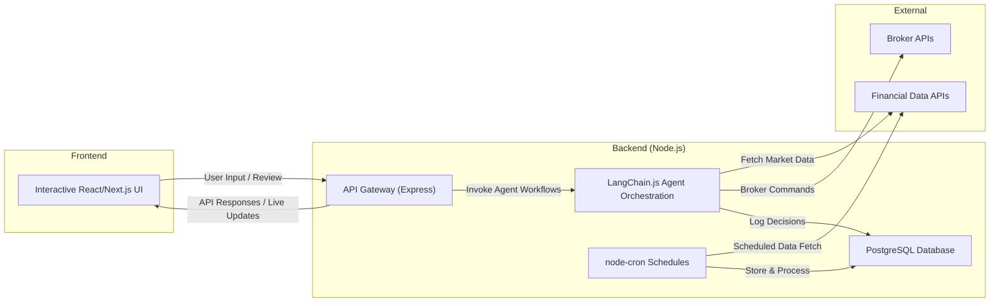

[Back to Documentation Overview](./readme.md)

# Technical Requirements Document

## 1. Introduction & High-Level Overview

Erisfy is an AI-powered financial market analysis tool that helps traders and investors identify opportunities using multi-agent reasoning. It integrates real-time data, orchestrates AI agents to provide actionable trade signals, and ensures human oversight with an interactive review and feedback loop.

## 2. System Architecture Overview

```text
              ┌─────────────────────────────────────┐
              │            Frontend UI              │
              │  (React/Next.js, Charting Library)  │
              └─────────────────────────────────────┘
                            ▲    │
         Real-Time Updates  │    │ REST/GraphQL APIs
                            │    ▼
              ┌─────────────────────────────────────┐
              │           Backend Server            │
              │  (NestJS in TypeScript on Nx)       │
              │   • Data Ingestion & Processing     │
              │   • Scheduling (node-cron)          │
              │   • AI Orchestration (LangChain.js) │
              │   • Database Integration            │
              │   • User Action Logging             │
              └─────────────────────────────────────┘
                            ▲    │
            API Integrations│    │ Database Queries
                            │    ▼
              ┌─────────────────────────────────────┐
              │         External APIs & DBs         │
              │  • Financial Data Providers         │
              │  • Broker APIs (Optional)           │
              │  • Managed DB (PostgreSQL/Mongo)    │
              └─────────────────────────────────────┘
```

### 2.1 Frontend (User Interface)

**Framework:**

React (or Next.js for server-side rendering) using TypeScript.

**Responsibilities:**

- Dashboard & Visualization: Render real-time charts, trade signals, and detailed agent reasoning.
- User Interactions: Enable operators to review, modify, and approve AI-generated trading decisions.
- Real-Time Updates: Utilize WebSockets or a suitable mechanism (e.g., GraphQL subscriptions) for live data.

**Managed Hosting Options:**

- Vercel or Netlify for deploying static frontends or Next.js applications, with built-in CI/CD from Git repos.

**Outstanding Questions:**

- Should we use GraphQL subscriptions instead of plain WebSockets for real-time data?
- How do we handle UI performance optimizations for high-frequency real-time updates?

### 2.2 Middleware / Agent Orchestration (LangChain.js Layer)

**Framework:**

LangChain.js in TypeScript.

**Responsibilities:**

- Agent Coordination: Orchestrates specialized agents (technical, fundamental, sentiment analysis, etc.) via chain-based modules.
- Workflow Management: Maintains conversation context and multi-step decision-making for AI-driven logic.
- External Integration: Fetches data from financial APIs (e.g., financialdatasets.ai) and issues simulated (or live) trading commands.

**Persistent Memory Considerations:**

- Use Redis or a vector database (Pinecone, pgvector, etc.) to store embeddings, conversation context, or agent memory.

**Managed Hosting Options:**

- Render, Railway, or Fly.io can host Node.js services (LangChain.js tasks) with minimal configuration.
- Possibly in the same service as the main backend or as a separate microservice.

**Outstanding Questions:**

- Do we need a full “stateful memory” for each agent, or can we rely on ephemeral memory plus database logs?
- How do we handle long-running asynchronous agent workflows and ensure idempotency if repeated?

### 2.3 Backend (API & Data Management)

**Environment:**

NestJS in TypeScript on Nx, using pnpm for packages.

**Responsibilities:**

- API Gateway: Exposes RESTful (or GraphQL) endpoints for the frontend and agent services.
- Data Persistence: Logs trading data, historical market info, and human decision feedback to a PostgreSQL database.
- Security: Handles authentication (JWT or OAuth) and secures API endpoints.
- Integration: Bridges the frontend, LangChain.js orchestration, external data, and scheduled tasks.

**Data Pipeline & Storage Strategy:**

- PostgreSQL for structured trading data and user records.
- Optional: MongoDB Atlas (or S3-like storage) for large, unstructured AI context logs if needed.
- Redis or Kafka for real-time data streaming, if high frequency data ingestion becomes a bottleneck.
- Node-cron (or @nestjs/schedule) for daily tasks (end-of-day market data ingestion).
- Docker Compose for local development (managing Postgres, NestJS API, and React client).
- Prisma ORM for database operations.

**Outstanding Questions:**

- Should we adopt GraphQL for more flexible queries, or stick to REST for simplicity?
- What is the best approach to handle large volumes of historical data (long-term archiving or data warehousing)?
- Do we need a separate concurrency layer (e.g., queue system) to handle daily ingestion at scale?

### 2.4 External Data & Broker Integration

**Data Providers:**

- Financial Datasets as the primary external data API.
- Additional market data or news sentiment APIs may be integrated down the road.

**Broker APIs:**

- Optional integrations (e.g., Alpaca, Interactive Brokers) for actual trade execution (initially simulated).

**Role in Architecture:**

- The LangChain.js agents (and the backend) call these external services to gather real-time or historical data.
- Results are stored or cached in the backend’s database for quick retrieval and cost control.

**Future Considerations:**

- News Sentiment: Integrate Alpha Vantage or other sentiment-driven APIs.
- Alternative Data: ESG ratings, macro indicators, Reddit sentiment, user-provided CSV data, etc.

**Outstanding Questions:**

- What is the caching strategy to limit API costs from frequent queries?
- Do we need data validation or cleansing steps to ensure data quality?

### 2.5 Human-in-the-Loop Interaction

**Operator Controls:**

- The React/Next.js frontend provides a control panel for reviewing AI-generated suggestions, overriding signals, or triggering backtests.

**Feedback Loop:**

- Operator inputs (e.g., overrides, confirmations) feed back into the LangChain.js layer for AI workflow adjustments.
- All decisions and user modifications are logged in PostgreSQL for auditing and iterative model improvements.

**Audit Trail:**

- The system logs every AI/human interaction for compliance and historical analysis.

**Outstanding Questions:**

- Do we provide an “explainability” view for each decision? If so, how do we format it for non-technical users?
- Should manual overrides feed into the model as training data, or remain separate?

### 2.6 Data Ingestion & Scheduled Tasks (New)

**Why This Section?**

We need a clear plan for running daily or periodic tasks, such as fetching end-of-day market data and computing metrics.

**Approach:**

- node-cron: A lightweight scheduling library that runs inside the Node.js backend.
- Example Use Case: At 4:00 PM (market close) on weekdays, fetch daily close data from financialdatasets.ai, compute derived metrics, and store them in PostgreSQL.
- Future Scalability: If data ingestion tasks grow or require concurrency, we may adopt a job queue (e.g., BullMQ with Redis).

**Implementation Sketch:**

```typescript
import cron from 'node-cron';
import axios from 'axios';
import { insertDailyClose } from './services/databaseService';

cron.schedule('0 21 * * 1-5', async () => {
  try {
    const response = await axios.get('https://api.financialdatasets.ai/v1/daily-closing');
    const data = response.data; // e.g., [{ symbol, closePrice, date }, ...]

    for (const item of data) {
      await insertDailyClose(item.symbol, item.closePrice, item.date);
    }

    console.log('Daily close data successfully ingested!');
  } catch (error) {
    console.error('Failed to fetch or store daily close data', error);
  }
}, {
  scheduled: true,
  timezone: 'America/New_York'
});
```

**Outstanding Questions:**

- Where do we store intermediate data or large datasets?
- What if the ingestion job fails? Do we need retry logic or alerting?

## 3. Hosting & Scalability Strategy

**Early-Stage Hosting (Development & MVP):**

- Docker Compose locally for Node.js (backend), PostgreSQL, and the React/Next.js frontend.
- Render, Railway, or Fly.io for production, as each provides low-cost hosting tiers for Node and managed Postgres.
- Vercel or Netlify for a separate React/Next.js frontend if needed.

**Growth-Stage Scalability Plan:**

- Containerize the Node.js services (backend, agent orchestration) and deploy to Kubernetes (AWS EKS, GKE) or continue using a PaaS with auto-scaling capabilities.
- Offload large data ingest or compute-heavy tasks to serverless functions (AWS Lambda, GCP Cloud Functions) if it simplifies overhead or costs.
- Evaluate a queue-based architecture (BullMQ, RabbitMQ, or Kafka) to handle concurrency and reliability for scheduled tasks.

**Outstanding Questions:**

- Do we need multi-region deployment to minimize latency for real-time trading?
- Will a serverless approach (e.g., AWS Lambda) conflict with the need for persistent scheduling (node-cron)?

## 4. Supporting Diagram



## 5. Summary & Next Steps

This document outlines Erisfy’s technical foundation using NestJS for the backend, LangChain.js for agent orchestration, a React/Next.js frontend, and PostgreSQL for data storage. Key additions include:

- Daily Data Ingestion with node-cron for end-of-day financial data.
- Local Development with Docker Compose for easy setup of Node, Postgres, and the frontend.
- Low-Cost Hosting on platforms like Render or Railway.

**Outstanding items include:**

- Finalizing GraphQL vs REST approach.
- Caching and scheduling strategies for large-scale data ingestion.
- Detailed design of agent “explainability” and auditing.

After finalizing these decisions, we can proceed with more in-depth implementation details (see next doc: 06 - Implementation Plan) to outline each AI agent’s role, memory management, and integration points.

**Next Document: [06 - Implementation Plan](./06%20-%20Implementation%20Plan.md)**
