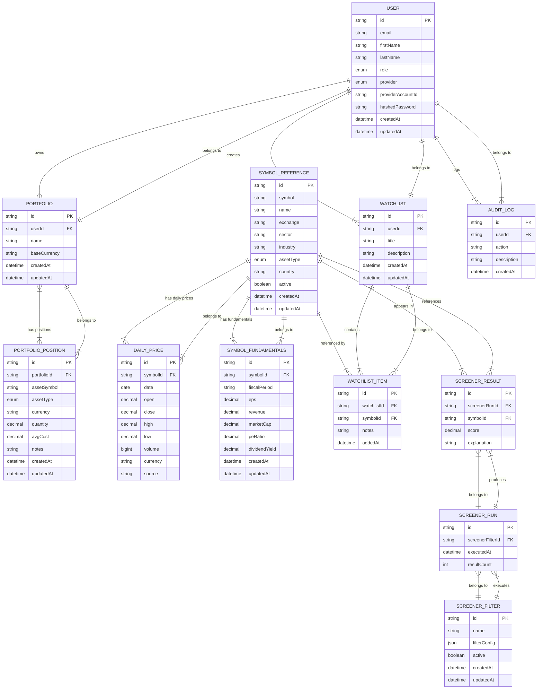

# Erisfy Database Structure

## Table of Contents

1. [Overview](#overview)
2. [Entity Relationship Diagram](#entity-relationship-diagram)
3. [Table Descriptions](#table-descriptions)
4. [Implementation Notes](#notes)

---

## Overview

The database is designed to support Erisfy's core functionalities including user management, portfolio tracking, watchlists, stock screening, and market data storage. The schema emphasizes data integrity, scalability, and efficient querying patterns.

---

## Entity Relationship Diagram

The following diagram illustrates the relationships between all database tables and their attributes.

---

## Table Descriptions

### Core Entities

| Table | Description |
|-------|-------------|
| USER | Stores user account information and authentication details |
| PORTFOLIO | Represents investment portfolios owned by users |
| PORTFOLIO_POSITION | Tracks individual positions within portfolios |
| SYMBOL_REFERENCE | Master table for all tradable securities and instruments |

### Market Data

| Table | Description |
|-------|-------------|
| DAILY_PRICE | Historical price data for symbols |
| SYMBOL_FUNDAMENTALS | Financial metrics and fundamental data |

### Watchlists & Screening

| Table | Description |
|-------|-------------|
| WATCHLIST | User-created lists of symbols |
| WATCHLIST_ITEM | Individual symbols within watchlists |
| SCREENER_FILTER | Saved screening criteria |
| SCREENER_RUN | Records of screen executions |
| SCREENER_RESULT | Results from screening runs |

### Auditing

| Table | Description |
|-------|-------------|
| AUDIT_LOG | System-wide activity tracking for security and compliance |

---

## Notes

- All tables include created/updated timestamps for change tracking
- Foreign keys maintain referential integrity
- Enum types are used for fixed-value fields like roles and asset types
- Decimal types are used for financial calculations to maintain precision
